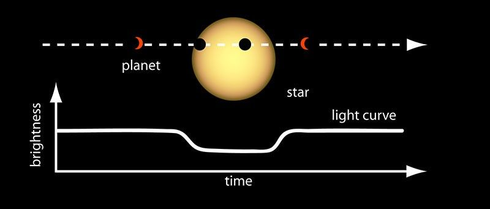
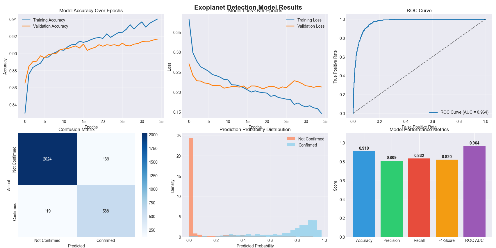

# Overview
Scientists use data collected by space telescopes such as Kepler to observe objects outside the solar system in order to gain a better understanding of our universe. One such target of interest are exoplanets, planets orbiting a star much like how Earth orbits our sun. As these planets are usually thousands of light years away, rather than directly attempting to observe them satellites record various data for each candidate that can be analysed in order to determine whether what scientists are observing is an exoplanet or another phenomenon. This data is specifically related to a lightcurve - a Brightness vs Time graph generated when a planet passes in front of its host star, creating a "dip" in its brightness as depicted below.

Credit: NASA Ames

Scientists can use this data to determine various pieces of information about the planet, for example its size and orbital period. 

This project attempts to create the ground work for creating machine learning models that can aid scientists in determining exoplanets by implementing a deep neural network (DNN) for exoplanet detection using NASA's Kepler Space Telescope data. By analyzing the photometric properties and orbital characteristics of Kepler Objects of Interest (KOIs), the model achieves 91% accuracy in distinguishing confirmed exoplanets from false positives and other non-planetary phenomena by analysing a multitude of astronomical features derived from transit photometry and stellar characterization, demonstrating the increasing potential of machine learning techniques in aiding astronomical discovery. As the transit method is the most successful and widely used method for determining exoplanets, it is possible to build on the framework used to create this model in order to adapt it for other missions such as TESS. 
# Data
The dataset used in this project was found on kaggle and was originally published by NASA and Caltech. It contains tabular data with a large number of columns and various astronomical measurements (if you wish to see the exact parameters, please open the feature_names.txt file). 
You can find the exact version of the dataset used here: https://www.kaggle.com/datasets/arashnic/exoplanets?resource=download 
# Code
The main code for building, training and testing the model can be found in the main_code file. If you would like to load and directly play around with the model, you can simply download it (it is saved as exoplanet_detection_model.h5). Please note that as the model was trained on tabular data, it is advised to primarily use it to analyse tabular datasets with similar parameters, although it is possible to use a transformed version of any data you like. Please ensure all requirements (as shown in the req.txt file) are installed prior to running the code.

# Evaluation
The model's final results were of good quality. It had an overall accuracy of 0.91 (shown in figure 1) and a ROC AUC of about 0.964, showing the model has a high probability of distinguishing a false positive candidate from an actual candidate. While these results are good, it does not mean the model is perfect as there are some key improvements that can be made. For example, rather than the DNN used here, a CNN (convolutional neural network) could be used instead as they are more powerful when it comes to visual processing. This would mean rather than using tabular data that contain the parameters used to create a lightcurve, it would be possible to directly analyse a lightcurve instead which would limit temporal loss and would be far more useful to scientists as it would cut out the need to convert data. In terms of real use cases, this model would most likely be used to screen candidates, separating the likely from the unlikely, before further analysis is done. 

Figure 1 showing the results of the model after training. 

# Further Research Directions

Overall the model has achieved the targets the project aimed for, namely laying the groundwork for future research. The main task to improve this model would be to update the architecture to use a CNN as mentioned above, enabling the model to interact directly with phase folded lightcurves. The project could also be improved by focusing more on multi-modal integration - for example incorporating spectroscopic data to give scientists the ability to view atmospheric composition. 
